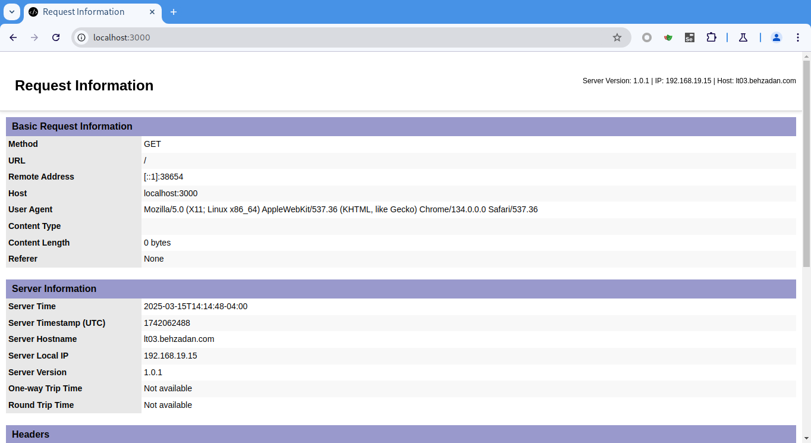

# HTTPEcho

[](https://github.com/rbehzadan/httpecho/releases/latest)
[](https://goreportcard.com/report/github.com/rbehzadan/httpecho)
[](https://github.com/rbehzadan/httpecho/blob/main/LICENSE)
[](https://github.com/rbehzadan/httpecho/pkgs/container/httpecho)

HTTPEcho is an HTTP request inspector that returns detailed information about incoming HTTP requests in either JSON or HTML format. It's useful for debugging, testing APIs, educational purposes, and understanding how HTTP requests work.



## Features

- 🔍 Detailed inspection of HTTP requests (headers, query parameters, body, etc.)
- 🔄 Response in either JSON or HTML format
- 🖥️ PHP-info style HTML display for better readability
- 🔒 Rate limiting to prevent abuse
- 🔌 Cross-Origin Resource Sharing (CORS) support
- 🧩 Docker support with non-root user for security
- 🔧 Highly configurable via environment variables

## Installation

### Using Docker

```bash
docker run -p 3000:3000 ghcr.io/rbehzadan/httpecho:latest
```

### From Binary Releases

Download the latest release for your platform from the [releases page](https://github.com/rbehzadan/httpecho/releases).

```bash
# Extract the archive
tar -xzf httpecho-X.Y.Z-linux-x86_64.tar.gz

# Run the binary
./httpecho
```

### From Source

```bash
# Clone the repository
git clone https://github.com/rbehzadan/httpecho.git
cd httpecho

# Build the binary
go build -o httpecho main.go

# Run the server
./httpecho
```

## Usage

### Basic Usage

Once running, you can send requests to the server:

```bash
# Get request details in JSON format
curl http://localhost:3000/

# Get request details in HTML format
curl http://localhost:3000/html

# Force JSON format with the Accept header
curl -H "Accept: application/json" http://localhost:3000/
```

### Environment Variables

HTTPEcho can be configured using the following environment variables:

| Variable       | Default    | Description                               |
|----------------|------------|-------------------------------------------|
| PORT           | 3000       | The port to listen on                     |
| MAX_BODY_SIZE  | 1048576    | Maximum request body size in bytes (1MB)  |
| RATE_LIMIT     | 100        | Maximum requests per rate window          |
| RATE_WINDOW    | 60         | Rate limiting window in seconds           |
| HTML_MODE      | false      | Default to HTML instead of JSON responses |

Example:

```bash
# Run with custom configuration
PORT=8080 RATE_LIMIT=50 HTML_MODE=true ./httpecho
```

## Docker Usage

### Running with Docker

```bash
docker run -p 8080:3000 -e HTML_MODE=true -e RATE_LIMIT=200 ghcr.io/rbehzadan/httpecho:latest
```

### Docker Compose

Create a `docker-compose.yml` file:

```yaml
version: '3'
services:
  httpecho:
    image: ghcr.io/rbehzadan/httpecho:latest
    ports:
      - "8080:3000"
    environment:
      - HTML_MODE=true
      - RATE_LIMIT=200
```

Run with:

```bash
docker-compose up -d
```

## API Endpoints

- `GET /` - Returns request information in JSON format (or HTML if HTML_MODE is enabled)
- `GET /html` - Always returns request information in HTML format
- `GET /favicon.ico` - Returns the application favicon

## Response Fields

The HTTP response includes a wide range of details about the request:

| Field                | Description                                      |
|----------------------|--------------------------------------------------|
| url                  | The requested URL                                |
| method               | HTTP method (GET, POST, etc.)                    |
| query_params         | URL query parameters                             |
| headers              | HTTP request headers                             |
| cookies              | Request cookies                                  |
| body                 | Request body (truncated if exceeds MAX_BODY_SIZE)|
| user_agent           | User-Agent header                                |
| remote_addr          | Client IP address                                |
| host                 | Host header                                      |
| referer              | Referer header                                   |
| content_length       | Content-Length header                            |
| content_type         | Content-Type header                              |
| server_time          | Current server time (RFC3339 format)             |
| server_timestamp_utc | Current server time (Unix timestamp)             |
| server_hostname      | Server hostname                                  |
| server_local_ip      | Server IP address                                |
| server_version       | Server version                                   |

## License

This project is licensed under the MIT License - see the [LICENSE](LICENSE) file for details.

## Contributing

Contributions are welcome! Please feel free to submit a Pull Request.

1. Fork the repository
2. Create a feature branch (`git checkout -b feature/amazing-feature`)
3. Commit your changes (`git commit -m 'Add some amazing feature'`)
4. Push to the branch (`git push origin feature/amazing-feature`)
5. Open a Pull Request
